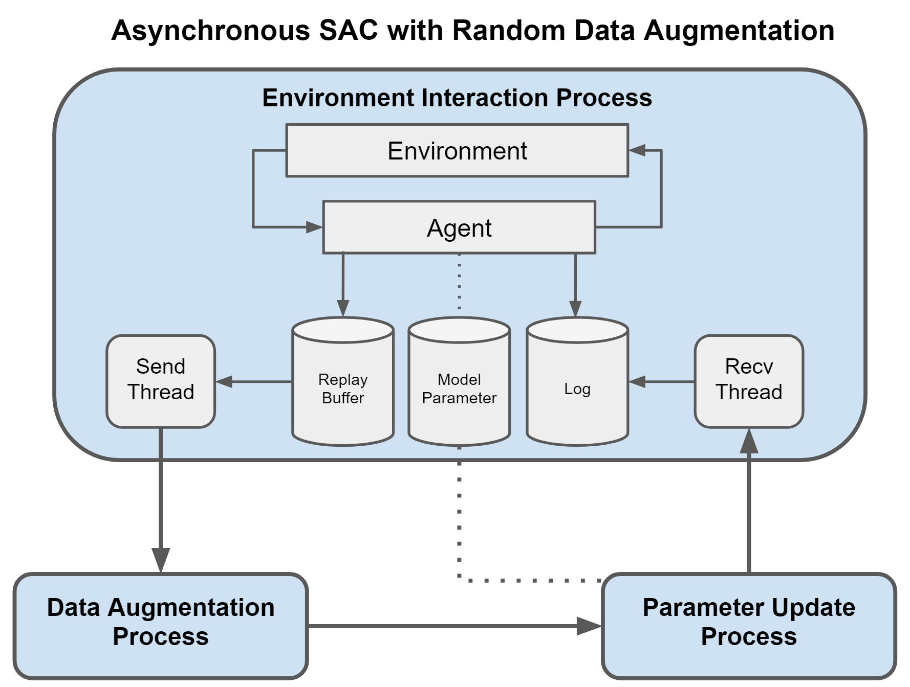

# Asynchronous SAC_RAD Implementation in Pytorch

This is the Pytorch implementation of pixel-based SAC with random data augmentation 
which supports both synchronous or asynchronous training. Currently tested on
DM_control.

## Architecture

The synchronous version acts as the ordinary SAC_RAD but the asynchronous version
execute environment interaction, data augmentation and parameter updating on 
different processes, so that the environment doesn't have to be paused to wait 
for updating. This property is critical to successfully apply SAC on real-world 
robotic tasks. The asynchronous version contains the following modules:



1. Environment interaction process
   * Interact with the environment, store transitions in the replay 
   buffer and record episode return in log
     
2. Data augmentation process
   * Apply random data augmentation to observations and
     convert them into tensors
     
3. Parameter update process
   * Perform SAC update on model parameters, where the parameters are share 
   from environment interaction process, and record training statistics
   
4. Send thread
   * Sample transitions from the replay buffer and send them to data 
   augmentation process
     
5. Data receive thread
   * Receive training statistics from the parameter update process,
   and write them into log
   
All the above processes and thread are running asynchronously and 
communicating with queues.
     
## Instructions
To train an SAC_RAD agent with asynchronous update 
on the `cheetah run` task from image-based DM_control,  run:
```
python3 dmc_train.py \
    --domain_name cheetah \
    --task_name run \
    --action_repeat 4 \
    --seed 0
    --async
```

where `--async` is the flag to enable asynchronous update, without it, 
ordinary SAC_RAD agent will be intialized


The console output is also available in a form:
```
| train | E: 1 | S: 1000 | D: 0.8 s | R: 0.0000 | BR: 0.0000 | ALOSS: 0.0000 | CLOSS: 0.0000 | RATIO: 0.0000
```
a training entry decodes as:
```
train - training episode
E - total number of episodes 
S - total number of environment steps
D - duration in seconds to train 1 episode
R - episode reward
BR - average reward of sampled batch
ALOSS - average loss of actor
CLOSS - average loss of critic
RATIO - number of gradient updates performed / current agent steps
```
